# Laporan Proyek Machine Learning

<table>
<tr>
<td>Nama</td>
<td>:</td>
<td>Muhammad Ridwan Wibisono</td>
</tr>
<tr>
<td>NIM</td>
<td>:</td>
<td>211351098</td>
</tr>
<tr>
<td>Kelas</td>
<td>:</td>
<td>Informatika Malam A</td>
</tr>
</table>

## Domain Proyek

Aplikasi Prediksi Kategori Hewan di Kebun Binatang ini merupakan suatu sistem yang mampu melakukan prediksi yang dapat membantu dalam menilai kategori hewan, dan dalam hal ini didasarkan pada data kebun binatang yang tersedia atau diberikan.

## Business Understanding

Proyek ini bertujuan untuk mengembangkan aplikasi yang dapat memprediksi kategori hewan di kebun binatang berdasarkan beberapa atribut atau ciri-ciri hewan yang diberikan. Kategori hewan yang dapat diprediksi meliputi: Mamalia, Burung, Reptil, Ikan, Amfibi, Serangga, dan Invertebrata. Kebun binatang sering kali memiliki kebutuhan khusus dalam mengelola dan menyajikan informasi tentang hewan-hewan yang mereka miliki.

Bagian laporan ini mencakup:

### Problem Statements

- Kebutuhan untuk mengklasifikasikan hewan secara otomatis berdasarkan atribut tertentu di kebun binatang.
- Sulitnya menyajikan informasi kategori hewan secara akurat dan efisien kepada pengunjung.
- Keterbatasan dalam sumber daya manusia untuk melakukan klasifikasi manual terhadap semua hewan di kebun binatang.

### Goals

- Membangun aplikasi prediksi kategori hewan yang dapat membantu kebun binatang mengelola dan menyajikan informasi dengan lebih baik.
- Memberikan solusi otomatis untuk mengklasifikasikan hewan di kebun binatang berdasarkan atribut tertentu.
- Meningkatkan pengalaman pengunjung dengan menyediakan informasi yang akurat dan mudah diakses tentang berbagai hewan di kebun binatang.

### Solution statements
- Mengembangkan model prediksi menggunakan machine learning untuk mengklasifikasikan hewan ke dalam salah satu dari tujuh kategori yang telah ditentukan.
- Model ini dilatih dengan algoritma decision tree yang diintegrasikan dengan dataset yang berisi atribut-atribut hewan di kebun binatang.
- Aplikasi akan menyediakan antarmuka yang ramah pengguna, memungkinkan staf kebun binatang untuk dengan mudah mengelola dan memperoleh informasi tentang hewan-hewan yang ada.

## Data Understanding
Dataset yang digunakan untuk pelatihan model ini berisi atribut-atribut yang relevan untuk berbagai jenis hewan di kebun binatang. Dataset tersebut mencakup informasi ciri ciri fisik hewan yang ada pada kebun binatang. Dataset akan dibagi menjadi data pelatihan dan data pengujian untuk evaluasi kinerja model.<br> 

[Zoo Animal Classification](https://www.kaggle.com/datasets/uciml/zoo-animal-classification).

Tabel data variabel ini diperoleh setelah melakukan cleaning pada dataset
<table>
  <tr>
    <th>No</th>
    <th>Variabel</th>
    <th>Keterangan</th>
    <th>Tipe Data</th>
  </tr>
  <tr>
    <th>1</th>
    <td>animal_name</td>
    <td>Menunjukkan nama hewan</td>
    <td>object</td>
  </tr>
  <tr>
    <th>2</th>
    <td>hair</td>
    <td>Menunjukkan apakah ciri-ciri hewan tersebut memiliki rambut atau tidak (0: tidak memiliki, 1: memiliki)</td>
    <td>int64</td>
  </tr>
  <tr>
    <th>3</th>
    <td>feathers</td>
    <td>Menunjukkan apakah ciri-ciri hewan tersebut memiliki bulu atau tidak (0: tidak memiliki, 1: memiliki)</td>
    <td>int64</td>
  </tr>
  <tr>
    <th>4</th>
    <td>eggs</td>
    <td>Menunjukan apakah hewan itu memiliki kemampuan untuk bertelur atau tidak (0: tidak , 1: ya)</td>
    <td>int64</td>
  </tr>
  <tr>
    <th>5</th>
    <td>milk</td>
    <td>Menunjukan apakah hewan itu memproduksi susu atau tidak (0: tidak memproduksi, 1: memproduksi)</td>
    <td>int64</td>
  </tr>
  <tr>
    <th>6</th>
    <td>airborne</td>
    <td>Menunjukan apakah hewan tersebut mempunyai kemampuan terbang di udara atau tidak (0: tidak memiliki, 1: memiliki)</td>
    <td>int64</td>
  </tr>
  <tr>
    <th>7</th>
    <td>aquatic</td>
    <td>Menunjukan apakah hewan tersebut mempunyai kemampuan hidup di dalam air atau tidak (0: tidak memiliki, 1: memiliki)</td>
    <td>int64</td>
  </tr>
  <tr>
    <th>8</th>
    <td>predator</td>
    <td>Menunjukan apakah hewan tersebut termasuk kedalam golongan hewan predator atau tidak (0: tidak , 1: ya)</td>
    <td>int64</td>
  </tr>
  <tr>
    <th>9</th>
    <td>toothed</td>
    <td>Menunjukkan apakah ciri-ciri hewan tersebut memiliki gigi atau tidak (0: tidak memiliki, 1: memiliki)</td>
    <td>int64</td>
  </tr>
  <tr>
    <th>10</th>
    <td>backbone</td>
    <td>Menunjukkan apakah ciri-ciri hewan tersebut memiliki ruas tulang belakang atau tidak (0: tidak memiliki, 1: memiliki)</td>
    <td>int64</td>
  </tr>
  <tr>
    <th>11</th>
    <td>breathes</td>
    <td>Menunjukkan apakah ciri-ciri hewan itu bernapas atau tidak (0: tidak , 1: ya)</td>
    <td>int64</td>
  </tr>
  <tr>
    <th>12</th>
    <td>venomous</td>
    <td>Menunjukkan apakah ciri-ciri hewan itu berbisa atau tidak (0: tidak , 1: ya)</td>
    <td>int64</td>
  </tr>
    <tr>
    <th>13</th>
    <td>fins</td>
    <td>Menunjukkan apakah ciri-ciri hewan tersebut memiliki sirip atau tidak (0: tidak memiliki, 1: memiliki)</td>
    <td>int64</td>
  </tr>
    <tr>
    <th>14</th>
    <td>legs</td>
    <td>Menunjukkan berapa banyak kaki yang dimiliki hewan tersebut</td>
    <td>int64</td>
  </tr>
    <tr>
    <th>15</th>
    <td>tail</td>
    <td>Menunjukkan apakah ciri-ciri hewan tersebut memiliki ekor atau tidak (0: tidak memiliki, 1: memiliki)</td>
    <td>int64</td>
  </tr>
    <tr>
    <th>16</th>
    <td>domestic</td>
    <td>Menunjukkan apakah hewan tersebut dapat dijinakkan dan dipelihara oleh manusia atau tidak (0: tidak , 1: ya)</td>
    <td>int64</td>
  </tr>
    <tr>
    <th>17</th>
    <td>catsize</td>
    <td>Menunjukkan apakah hewan tersebut memiliki ukuran tubuh serupa dengan kucing atau tidak (0: tidak , 1: ya)</td>
    <td>int64</td>
  </tr>
    <tr>
    <th>18</th>
    <td>class_type</td>
    <td>Menunjukan Kategori hewan</td>
    <td>int64</td>
  </tr>
    <tr>
    <th>19</th>
    <td>Class_Type</td>
    <td>Menunjukan Kategori hewan</td>
    <td>object</td>
  </tr>
</table>

## Data Preparation
Pada tahap ini, saya menggunakan metode EDA untuk melakukan preparasi data.
### Data Collection
Untuk data collection ini, saya mendapatkan dataset dari website kaggle dengan nama dataset [Zoo Animal Classification](https://www.kaggle.com/datasets/uciml/zoo-animal-classification), jika anda tertarik dengan datasetnya, anda bisa click link tersebut.

### Data Discovery And Profiling
Karena kita menggunakan google colab untuk mengerjakannya maka kita akan import files, Lalu mengupload token kaggle agar nanti bisa mendownload sebuah dataset dari kaggle melalui google colab,
``` bash
from google.colab import files
files.upload()
```

Setelah mengupload filenya, maka kita akan lanjut dengan membuat sebuah folder untuk menyimpan file kaggle.json yang sudah diupload tadi,
``` bash
!mkdir -p ~/.kaggle
!cp kaggle.json ~/.kaggle/
!chmod 600 ~/.kaggle/kaggle.json
!ls ~/.kaggle
```

Lalu mari kita download datasetsnya,
``` bash
!kaggle datasets download -d uciml/zoo-animal-classification
```

Selanjutnya kita harus extract file yang tadi telah didownload,
``` bash
!unzip zoo-animal-classification.zip -d animal
!ls animal
```

Kita mengimport semua library yang dibutuhkan, 
``` bash
import pandas as pd
import numpy as np
import matplotlib.pyplot as plt
import seaborn as sns
import plotly.express as ex
import pickle
from sklearn.tree import DecisionTreeClassifier
from sklearn.tree import plot_tree
from sklearn.metrics import confusion_matrix
from sklearn import metrics
```

Lanjut dengan memasukkan file csv yang telah diextract pada sebuah variable, dan melihat 5 data paling atas dari datasetsnya,
``` bash
data_zoo = pd.read_csv("animal/zoo.csv")
data_class = pd.read_csv("animal/class.csv")
display(data_zoo.head())
display(data_class)
```

Saya perlu melihat data pada Class_Type,
``` bash
class_types = list(data_class['Class_Type'])
class_types
```

Kita kelompokan Class_Type dengan nomor menggunakan class_map,
``` bash
class_map = {}
for i in range(data_class.shape[0]):
    class_map[data_class['Class_Number'].iloc[i]] = data_class['Class_Type'].iloc[i]

class_map
```

Saya perlu menghapus beberapa field yaitu Class_Number, Number_Of_Animal_Species_In_Class, dan Animal_Names pada data tersebut, lalu menampilkannya,
```  bash
data.drop(['Class_Number', 'Number_Of_Animal_Species_In_Class', 'Animal_Names'], axis=1, inplace=True)
data.head()
```

Kemudian saya ingin melihat ada berapa banyak jumlah datanya,
```  bash
data.shape
```

Kita juga perlu melihat apakah ada data yang kosong atau tidak,
```  bash
data.isnull().sum()
```
Ternyata aman tidak ada sama sekali data yang kosong,

Kita juga bisa mengecek apakah ada data yang kosong dengan menggunakan heatmap,
```  bash
sns.heatmap(data.isnull())
```
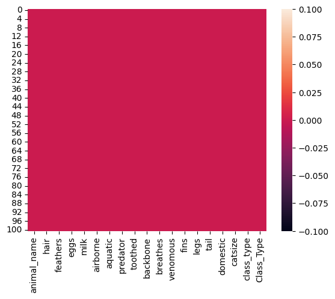

Lalu kita dapat melihat informasi rinci tentang DataFrame,
``` bash
data.info()
```
### EDA (Exploratory Data Analysis)
Kemudian kita dapat menggambar histogram dari DataFrame atau satu kolom data. Histogram adalah representasi grafis dari distribusi frekuensi suatu variabel.
```  bash
data.hist(bins=10,figsize=(15,15))
plt.show()
```
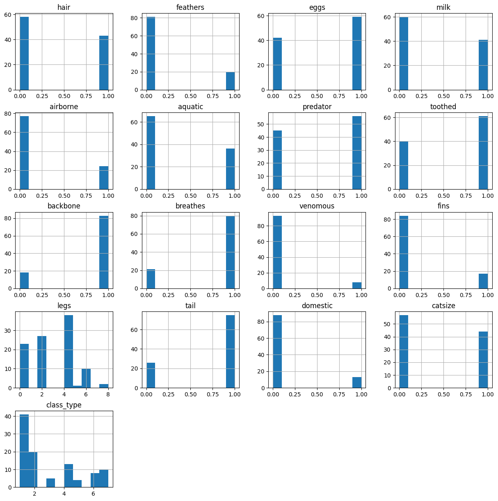

Kita coba visualisasikan data Class_type menggunakan diagram batang,
```  bash
# Visualizer 'Class_Type'.
plt.figure(figsize = (12,8))
plt.grid(True)
ax = sns.countplot(x='Class_Type', data=data, palette='viridis_r')
for p in ax.patches:
        ax.annotate('{:.0f}'.format(p.get_height()), (p.get_x()+0.35, p.get_height()+0.8))
```
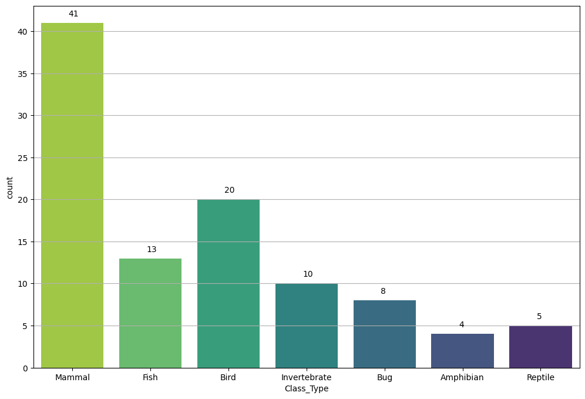

Kita juga bisa coba visualisasikan data Class_type menggunakan diagram lingkaran atau pie untuk melihat persentase datanya,
```  bash
# Check the proportion within the target variable 'Class_Type'.
ex.pie(data,names='Class_Type',title='Proportion of different classes',hole=0.33)
```
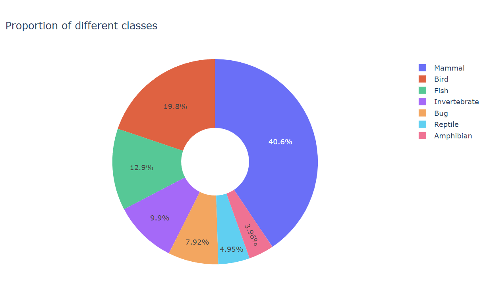

Kita coba juga dengan data yang lain misalnya data legs dan data venomous untuk masing masing diagramnya, berikut untuk masing masing diagramnya,

Diagram batang Legs,
```  bash
# Visualizer 'legs'.
plt.figure(figsize = (12,8))
plt.grid(True)
ax = sns.countplot(x='legs', data=data, palette='viridis_r')
for p in ax.patches:
        ax.annotate('{:.0f}'.format(p.get_height()), (p.get_x()+0.35, p.get_height()+0.8))
```
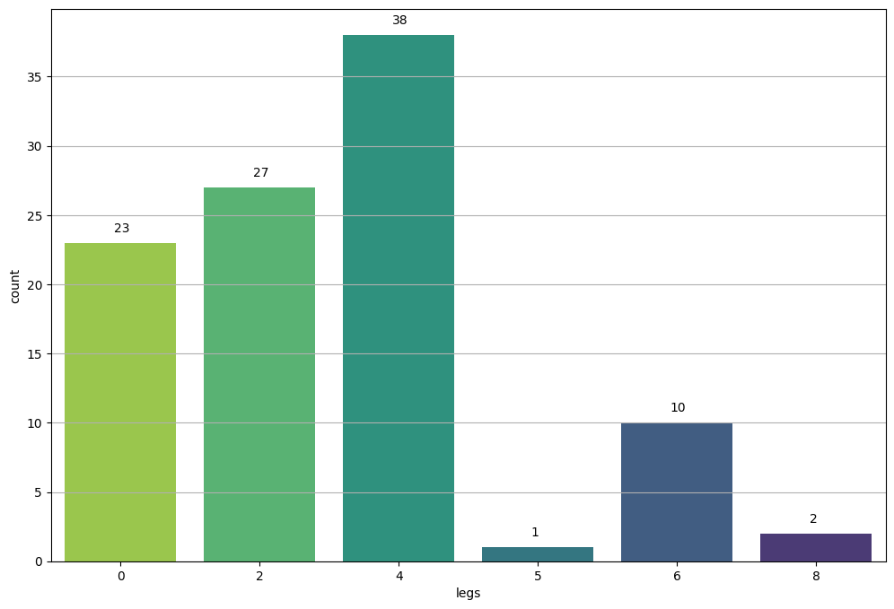

Diagram lingkaran Legs,
```  bash
# Check the proportion within the target variable 'legs'.
ex.pie(data,names='legs',title='Percentage of different legs',hole=0.33)
```
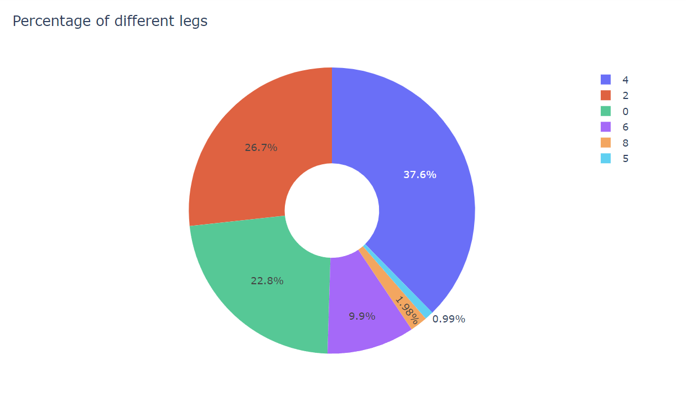

Diagram batang Venomous nilai 0 untuk tidak dan 1 untuk ya,
```  bash
# Visualizer 'venomous'.
plt.figure(figsize = (12,8))
plt.grid(True)
ax = sns.countplot(x='venomous', data=data, palette='viridis_r')
for p in ax.patches:
        ax.annotate('{:.0f}'.format(p.get_height()), (p.get_x()+0.35, p.get_height()+0.8))
```
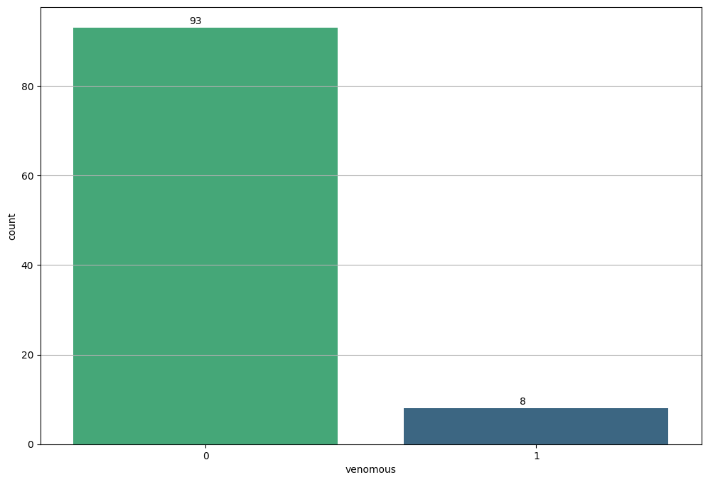

Diagram lingkaran Venomous,
```  bash
# Check the proportion within the target variable 'venomous'.
ex.pie(data,names='venomous',title='Proportion of different venomous',hole=0.33)
```
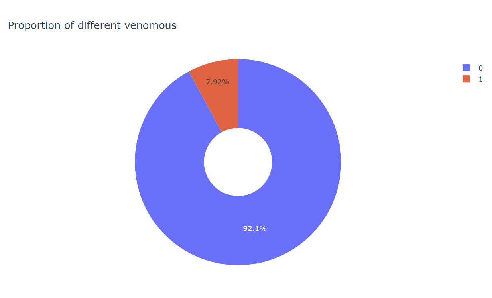

### Preprocessing
Dalam pembagian data biasa menjadi set Pelatihan dan Uji, ada kemungkinan semua data hewan jenis Amfibi berada di set Pelatihan atau semua berada di set Uji. Ini dapat mengurangi akurasi model kita. Oleh karena itu, kita perlu membagi data secara terpisah berdasarkan jenis hewan.

Kita ingin memastikan bahwa data dari setiap jenis hewan di kebun binatang dibagi dengan rata antara set Pelatihan dan set Uji. Dengan kata lain, jumlah Amfibi dalam set Pelatihan dan set Uji harus seimbang.

Ini dilakukan untuk memastikan bahwa model yang kita latih memiliki representasi yang baik dari setiap jenis hewan dan dapat menghasilkan hasil yang lebih baik saat diuji pada jenis hewan yang tidak pernah dilihat selama pelatihan.

Jadi, intinya adalah memastikan bahwa setiap jenis hewan memiliki proporsi yang setara di antara set Pelatihan dan set Uji untuk mencegah potensi ketidakseimbangan dan mendapatkan hasil yang lebih dapat diandalkan saat menguji model kita.
```  bash
# Seperating all the categories of animals in a dictionary
animal_type = {}
animal_category = data.Class_Type.unique()
print("Seperating Categories...")
for category in animal_category:
    animal_type[category] = data[data['Class_Type']==category]
print("Seperation Completed.")
```

```  bash
#Here we will split every category into trainig and test data
SPLIT = 0.85
train = pd.DataFrame() #to combine all the splited traning data from all categories
test = pd.DataFrame() #to combine all the splited test data from all categories
for category_name in animal_type:
    m = int(animal_type[category_name].shape[0] * SPLIT)
    train = pd.concat([train, animal_type[category_name].iloc[: m, :]])
    test = pd.concat([test, animal_type[category_name].iloc[m:, :]])

#Shuffling the train and test data randomly
train = train.sample(frac=1)
test = test.sample(frac=1)
```

Kita lihat berapa banyak data Training dan data Testing,
```  bash
print(f"Training data shape = {train.shape}")
print(f"Testing data shape = {test.shape}")
```

Kita lihat DataFrame data train nya,
```  bash
train.head()
```

Kita akan memisahkan fitur (X) dan label (y) dari set data latihan (train) dan uji (test),
```  bash
# We have already split the data into 85% train and 15% test data
X_train = train.iloc[:,1:-2] # not using animal_name and class_type and Class_Type(category of animal)
y_train = train.iloc[:, -2] # class_type is the dependent feature
X_test = test.iloc[:, 1:-2]
y_test = test.iloc[:, -2]
```
## Modeling
Kita perlu menerapkan algoritma Decision Tree Classifier pada DataFrame yang sudah disiapkan,
```  bash
dtc = DecisionTreeClassifier()
dtc.fit(X_train, y_train)

y_pred = dtc.predict(X_test)
```

Kemudian kita perlu mengetahui berapa score yang didapatkan dari model yang telah kita buat,
```  bash
print(f"Accuracy = {metrics.accuracy_score(y_test, y_pred)}")
print(metrics.classification_report(y_test, y_pred))
```
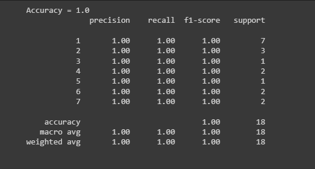
Ternyata mendapatkan Score Accuracy yang sempurna 100%.

Oke, sekarang kita mulai untuk pengujiannya. Untuk Pengujian disini saya menggunakan fitur pada ciri ciri manusia,
```  bash
#tried manually with human feature values
predd = {}
predd['hair'] = 1
predd['feathers'] = 0
predd['eggs'] = 0
predd['milk'] = 1
predd['airborne'] = 0
predd['aquatic'] = 0
predd['predator'] = 1
predd['toothed'] = 1
predd['backbone'] = 1
predd['breathes'] = 1
predd['venomous'] = 0
predd['fins'] = 0
predd['legs'] = 2
predd['tail'] = 0
predd['domestic'] = 0
predd['catsize'] = 0

pred_df = pd.DataFrame(data=predd, index=['value'])
custom_pred = dtc.predict(pred_df)
print('Class Type :', class_map[custom_pred[0]])
```
Dan ini hasil yang di peroleh dari pengujiannya,<br>


Setelah pengujian model berhasil saya ingin memvisualisasi hasil algoritma yang kita terapkan yaitu  Decision Tree Classifier,
```  bash
fig = plt.figure(figsize=(25,20))
_ = plot_tree(dtc, feature_names=X_train.columns,
                class_names=class_types, filled=True)
```
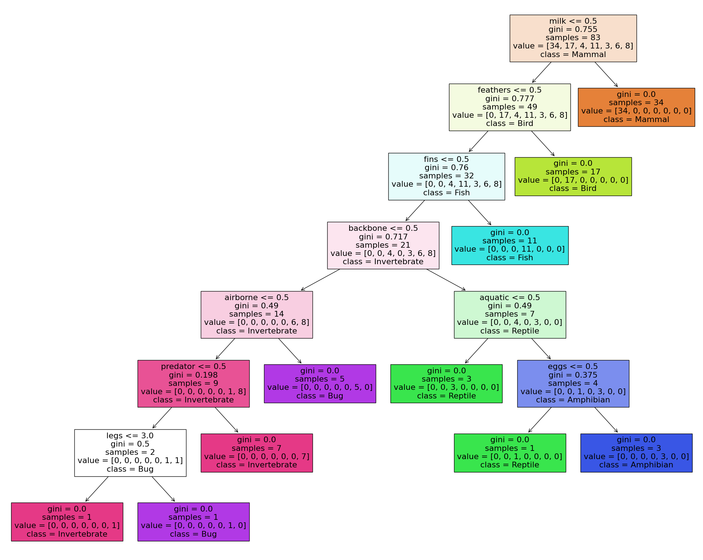

## Evaluation
Matrik evaluasi yang saya gunakan disini adalah confusion matrix, karena sangat cocok untuk kasus pengkategorian seperti kasus ini. Dengan membandingkan nilai aktual dengan nilai prediksi.
``` bash
cm = confusion_matrix(y_test, y_pred)
sns.heatmap(cm,annot=True)
```
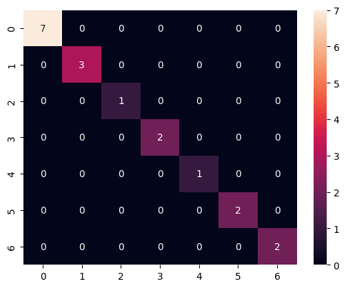

## Deployment

[Prediction Animal Class Type App](https://aplikasi-prediksi-penyakit-stroke.streamlit.app/).

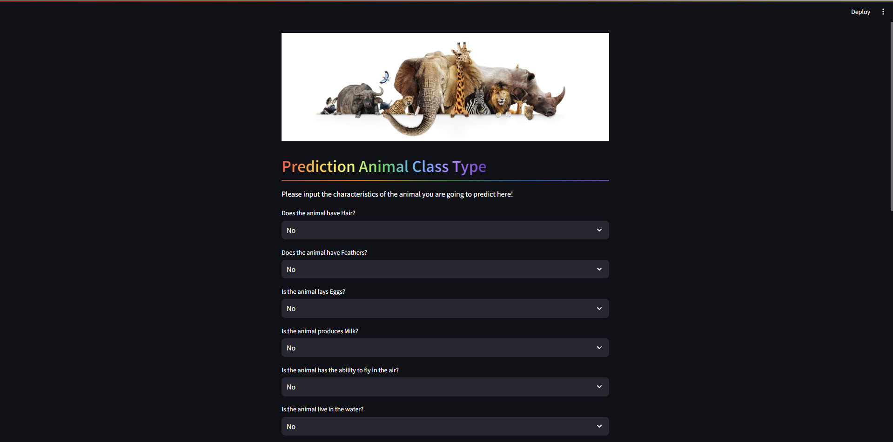
